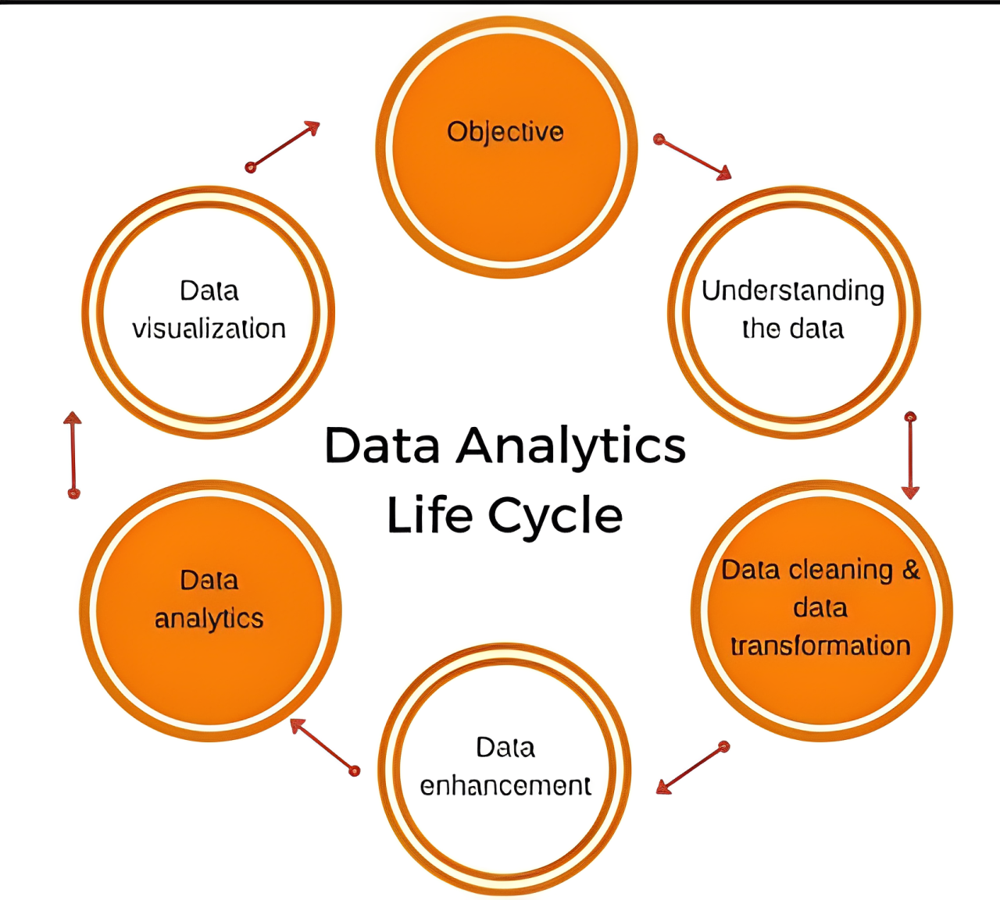

# AI’s Impact: Redefining Jobs and Workplaces

## Introduction
In the ever-evolving landscape of work, the emergence of artificial intelligence (AI) has been both a beacon of innovation and a harbinger of change. As businesses embrace AI technologies to streamline processes, enhance productivity, and gain competitive advantage, the implications for employee jobs are profound and far-reaching. From automation and augmentation to the reshaping of entire industries.

## Getting Started
The impact of AI on employment is a topic of both fascination and concern. Through rigorous analysis and examination, I aim to provide a comprehensive understanding of the multifaceted impact AI exerts on different facets, such as industries, job roles, human-performed tasks, and workload ratio.

