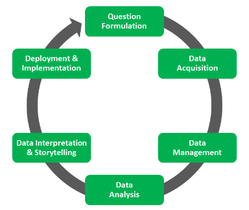

# AI’s Impact: Redefining Jobs and Workplaces

## 1. Introduction
In the ever-evolving landscape of work, the emergence of artificial intelligence (AI) has been both a beacon of innovation and a harbinger of change. As businesses embrace AI technologies to streamline processes, enhance productivity, and gain competitive advantage, the implications for employee jobs are profound and far-reaching. From automation and augmentation to the reshaping of entire industries.

## 2. Getting Started
The progression of a data analysis project mirrors the stages of evolution as depicted in the image below. The impact of AI on employee jobs follows the same life cycle.

### 2.1 Question Formulation
What is impact of AI on employment? This is a topic of both fascination and concern. Through rigorous analysis and examination, I aim to provide a comprehensive understanding of the multifaceted impact AI exerts on different facets, such as industries, job roles, human-performed tasks, and workload ratio.

### 2.2 Data Acquition
The dataset `My_Data.csv` was acquired from [here](https://www.kaggle.com/datasets/manavgupta92/from-data-entry-to-ceo-the-ai-job-threat-index).

### 2.3 Data Management
Various steps where performed to understand, clean and engineer the raw data:
1. DATA INFORMATION: In this section of the notebook, 'AI_Impact_On_Jobs.ipynb', an effort is made to thoroughly explain each feature, its intended purpose, and the dataframe's shape.
2. PERFORMING DATA CHECK: This section aims to improve data quality by conducting various checks, including validating data types, performing statistical analyses, addressing missing values, handling anomalies, and eliminating duplicates.
3. FEATURE ENGINEERING: In this section, specific features in the dataset undergo transformations. This is carried out to further increase the data quality, aiming for clearer and more discernible results during analysis.

### 2.4 Data Analysis
In the "Exploring Data" section of the notebook, a comprehensive analysis of the impact of AI on jobs is presented. Here:
1. Efforts are made to comprehend the relationships between various features
2. Assess feature influence on employee jobs.
3. Examine the distribution of feature types.
4. Understand the behavior of the features and look for patterns.

### 2.5 Data Interpretation & Storytelling
After completing the analysis, it's essential to extract clear, comprehensible, and significant insights. This step is crucial as it aids in identifying practical and easily implementable solutions. In my comprehensive blog titled [AI’s Impact: Redefining Jobs and Workplaces](https://medium.com/@yashu.chauhan1909/7a754e63ab62), I delve into the analysis findings, aiming to offer a deeper understanding of how Artificial Intelligence will reshape the future of workplaces.

### 2.6 Deployment & Implementation
The "Deployment & Implementation" phase of the Data Analysis Life Cycle involves putting the insights and solutions derived from the analysis into action. This phase focuses on integrating the findings into real-world systems or processes, often through the development and deployment of software applications, models, or tools. It also encompasses creating documentation, training materials, and support mechanisms to ensure successful adoption by stakeholders. Continuous monitoring and evaluation are key during this phase to assess the effectiveness of the implemented solutions and make necessary adjustments. Overall, successful deployment and implementation ensure that the insights gained from data analysis drive tangible outcomes and business value.

## Conclusion
The impact of AI isn’t as straightforward as it seems, with certain aspects being more affected than others. As the world advances, stepping into the age of artificial intelligence brings both opportunities and challenges. However, it’s certain that humanity will experience another wave of revolution, shaping the future of work and society.
